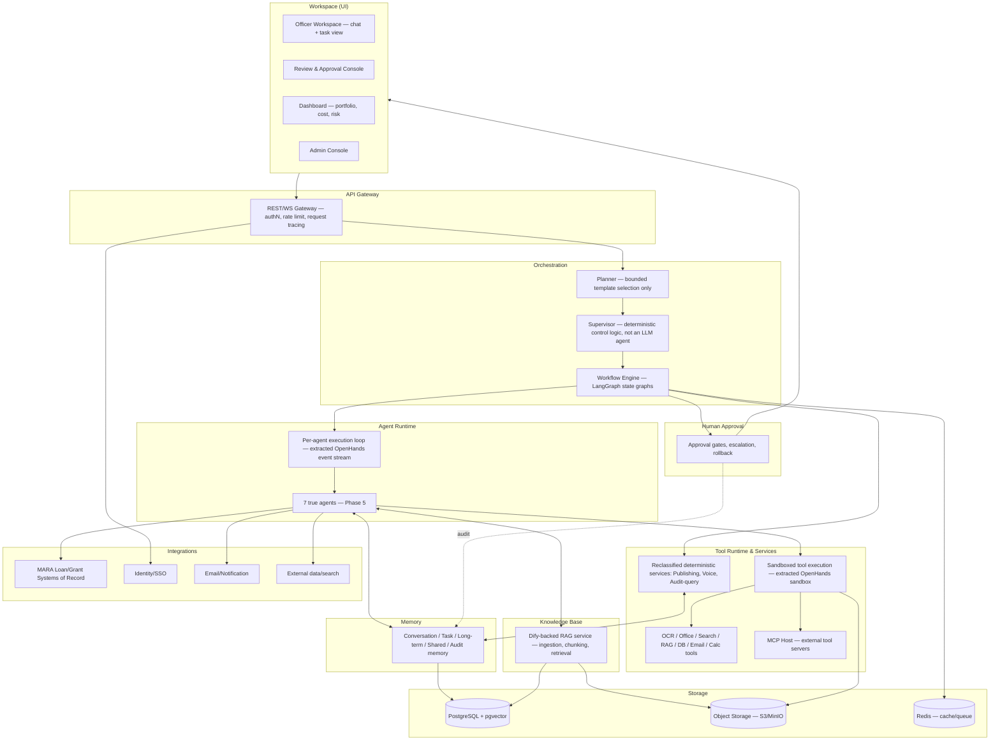

« [Index](00-INDEX.md) | Phase 2 of 16 »

# Phase 2 — Enterprise System Architecture

## 2.1 Layer diagram

## 2.2 Layer responsibilities

### Workspace (UI)
The single officer-facing surface: a purpose-built application (`apps/officer-workspace/`, React, event-stream-driven) consuming an event-stream client extracted from the OpenHands frontend and the `openhands-ui` design system, enriched with LibreChat-style conversation management and file upload, plus MARA-specific views — a Review & Approval Console for pending human gates, a portfolio Dashboard, and an Admin Console for user/role/agent configuration. This is deliberately a new application, not a reskin of OpenHands' own coding-agent frontend screens — see [04-technology-stack.md](04-technology-stack.md) §4.2 for why. It never talks to agents directly; every action goes through the API Gateway so authentication, tracing, and audit capture are uniform regardless of client.

### API Gateway
Single entry point for all client traffic. Owns authentication (session/JWT validation against the Identity provider), authorization pre-checks, rate limiting, request correlation-ID assignment (used end-to-end for tracing, see [12-observability.md](12-observability.md)), and request/response schema validation. No business logic lives here — it is a thin, replaceable edge.

### Orchestration — Planner, Supervisor, Workflow Engine
- **Planner** takes an officer's stated objective ("assess this loan application") and *selects and parameterizes* a bounded, versioned workflow template — it does not freely construct new graph topology at runtime. This constraint is load-bearing, not stylistic: an LLM emitting executable orchestration structure is exactly the kind of unbounded surface that could, in principle, produce a plan skipping a mandatory approval node, and it is not something prompting alone can be trusted to prevent. See [07-workflow-architecture.md](07-workflow-architecture.md).
- **Supervisor** is deterministic control logic, not an LLM-reasoning agent — dispatching tasks, monitoring for failure/timeout, enforcing per-agent permission and budget limits, and deciding retry vs. escalate vs. fail via policy evaluation, not judgment. It is implemented as LangGraph control flow, with no prompt, confidence threshold, or escalation-target concept of its own to maintain. See [05-agent-architecture.md](05-agent-architecture.md) §5.3.
- **Workflow Engine** (LangGraph) is the durable substrate both run on: a checkpointed state graph per workflow instance, persisted to Postgres, so a workflow can pause at a human-approval node for hours or days and resume exactly where it left off, survive a process restart, and be resumed by a different worker than the one that paused it.

The Planner/Supervisor split matters because they change independently: planning strategy (which template fits, and how to parameterize it) is a reasoning problem that will be tuned and evaluated constantly; supervision (retries, budgets, failure policy) is an operational-reliability problem with deterministic, testable behavior. Conflating them into one component would force every planning-prompt change through the same review bar as a reliability-critical retry policy — and would wrongly imply the Supervisor needs the same LLM-reasoning apparatus the Planner does.

### Agent Runtime
Executes one agent's turn: given a task and its allowed tools/memory, runs an LLM-driven action/observation loop until the agent emits a result or asks for tools. This is built on OpenHands' existing event-stream execution model (`openhands/app_server/event`, `event_callback`), extracted and depended on as a library boundary rather than modified in place — see [04-technology-stack.md](04-technology-stack.md) for why this is an extraction, not a fork of the whole tree. Each of the **7 true agents** (Planner, Document, Compliance, Finance, Risk, Market, Recommendation — detailed in [05-agent-architecture.md](05-agent-architecture.md)) is a configuration of this runtime: system prompt, allowed tools, memory scope, and confidence/escalation policy. Five originally-proposed components (Supervisor, Report, Presentation, Voice, Audit) do not run here — they are deterministic services, described in the next section and in [05-agent-architecture.md](05-agent-architecture.md) §5.14.

### Tool Runtime & Services
Executes the actual side-effecting work an agent or service requests — OCR a document, render a PowerPoint, query a database, hit a search API — inside the sandbox already provided by OpenHands (`app_server/sandbox`, extracted per the same library-boundary principle as the Agent Runtime). Every tool call is permission-checked against the caller's grant, timed out, retried per policy, and logged before the result is returned. The Tool Runtime also hosts an **MCP host** (OpenHands already has `app_server/mcp`), which is the extension point for adding new tools as MCP servers without redeploying the core platform — see [06-tool-architecture.md](06-tool-architecture.md). This layer also hosts the **reclassified deterministic services**: the merged Publishing service (Report + Presentation rendering), the Voice service (TTS/STT tool wrapping), and the Audit-query service (structured audit queries, with a thin narrative-generation agent layered on top only for that one specific use case) — none of these run an LLM-reasoning loop of their own by default.

### Memory
Provides every agent and workflow with scoped read/write access to the six memory kinds detailed in [08-memory-architecture.md](08-memory-architecture.md): conversation, task, long-term, knowledge, shared, and audit. Memory is a service boundary, not "whatever's in the LLM context window" — this is what lets a workflow resume after a multi-day approval pause with full context intact.

### Knowledge Base
The enterprise RAG system — policy documents, precedent, market data, product terms — served by an internal Dify-backed service (ingestion, chunking, embedding, retrieval API; see [09-knowledge-architecture.md](09-knowledge-architecture.md)) running on its own, separate database instance from the platform's primary Postgres. Agents query it as a tool call, never by embedding raw documents in a prompt.

### Human Approval
A first-class service, not a UI convention: workflows reach explicit approval nodes in the LangGraph state machine, which write a pending-approval record, notify the relevant human role, and block workflow progress until an approve/reject/correct decision is recorded. See [10-human-in-the-loop.md](10-human-in-the-loop.md).

### Dashboard
Read path over the Storage and Observability layers: portfolio throughput, per-agent cost and latency, risk flags outstanding, pending approvals by officer. Consumes aggregated data, never triggers agent actions directly.

### Storage
- **PostgreSQL + pgvector**: system of record for conversations, tasks, workflow checkpoints, memory, audit log, and vector embeddings — one transactionally consistent store rather than a vector DB that can drift from the relational truth.
- **Object storage (S3-compatible / MinIO)**: source documents, generated artifacts (reports, decks, audio), OCR intermediates.
- **Redis**: caching and the auxiliary task queue for ancillary async jobs (see [04-technology-stack.md](04-technology-stack.md)).

### Integrations
Outbound/inbound connectors to systems MARA AI-ETC does not own: the loan/grant systems of record (read for context, write only through reviewed, human-approved channels), the corporate identity provider, email/notification, and external data/search APIs. All integration calls are tools, subject to the same permission/audit discipline as internal tools — an agent does not get an implicit trust boundary just because the target is "internal."

## 2.3 Cross-cutting concerns

These are not layers; they apply to every layer above and are detailed in their own phases:

- **Security** ([11-security-architecture.md](11-security-architecture.md)): RBAC/ABAC enforced at the Gateway and re-checked at the Tool Runtime (defense in depth — a compromised agent prompt must not be able to bypass tool-level permission checks).
- **Observability** ([12-observability.md](12-observability.md)): every layer emits structured events to a common tracing/metrics pipeline, correlated by the Gateway-issued request ID and the workflow's LangGraph run ID.
- **Audit** ([10-human-in-the-loop.md](10-human-in-the-loop.md), [11-security-architecture.md](11-security-architecture.md)): the Audit Memory is written to by the Supervisor, Tool Runtime, and Human Approval service independently, so no single compromised component can suppress its own audit trail.

## 2.4 Why this shape

The layering deliberately separates **deciding what to do** (Orchestration) from **doing it** (Agent Runtime + Tool Runtime & Services) from **remembering it** (Memory) from **being allowed to do it** (Human Approval + Security). This is what makes the audit and human-oversight requirements in [01-vision.md](01-vision.md) achievable: because tool execution is centralized in one runtime with one permission model, "did anything happen without authorization" is answerable by querying one place, not by reconciling every agent's and service's individual logging conventions. This is also, independently, why the agent-vs-service reclassification ([05-agent-architecture.md](05-agent-architecture.md) §5.14) doesn't weaken this property: a service enforces the exact same Tool Runtime permission checks and audit logging as an agent — reclassification changes whether a component carries an LLM-reasoning loop, not whether it's subject to the platform's permission and audit discipline.
