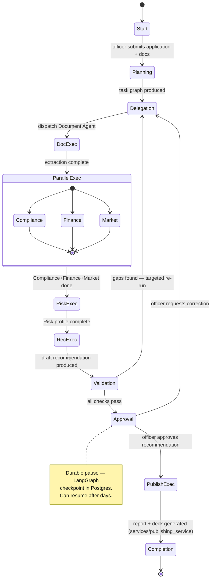

« [Index](00-INDEX.md) | Phase 7 of 16 »

# Phase 7 — Workflow Architecture

> **v1.0 note:** this phase now states explicitly, per ACCB Condition C-2 and Review Board Finding A1, that every workflow below is a **bounded, versioned template** the Planner selects and parameterizes — never graph topology constructed freely at runtime (see [05-agent-architecture.md](05-agent-architecture.md) §5.2.1). References to "Supervisor" mean `services/supervisor_service` (deterministic control logic, not an LLM agent — §5.10); references to "Report"/"Presentation"/"Voice" agents are updated to their reclassified service names (§5.11).

## 7.1 Common workflow stage model

Every workflow below is one of a fixed set of LangGraph state-graph **templates** ([04-technology-stack.md](04-technology-stack.md)), each with the same eight stages, so that the Dashboard, the Audit Service, and the officer-facing status UI can render any workflow uniformly regardless of its business content:

**Start → Planning → Delegation → Execution → Validation → Approval → Completion → Audit**

- **Start**: officer initiates with an objective and source materials; workflow instance created, checkpointed immediately.
- **Planning**: the Planner agent selects and parameterizes one of the bounded templates catalogued in §7.3 for this instance — it does not derive new graph structure ([05-agent-architecture.md](05-agent-architecture.md) §5.2.1). The Planner's output is validated against the selected template's declared schema before Delegation begins; any reference outside that schema is rejected.
- **Delegation**: `services/supervisor_service` dispatches tasks to the relevant agents per the selected template, respecting declared dependencies (e.g., Risk Agent cannot run before Finance/Compliance/Market outputs exist).
- **Execution**: agents run via the Agent Runtime, calling tools via the Tool Runtime; all intermediate results land in Shared/Task Memory.
- **Validation**: automated checks — confidence thresholds met, required citations present, no unresolved agent errors — gate progression to Approval. A workflow that fails Validation returns to Execution (targeted re-run) or escalates, it does not silently proceed to Approval with gaps.
- **Approval**: one or more Human Approval gates ([10-human-in-the-loop.md](10-human-in-the-loop.md)) per workflow-specific policy; the graph pauses here, durably, until a decision is recorded.
- **Completion**: approved artifacts are finalized (written to Object Storage as the canonical version, status updated); any post-approval side effects (e.g., notification) fire only now.
- **Audit**: not a step that "happens after" — every prior stage writes to Audit Memory as it executes; this stage is the point at which the Audit Service's reconstruction is guaranteed complete and the workflow instance is marked closed.

## 7.2 Reference workflow — Loan Assessment

Document extraction runs first because Compliance, Finance, and Market all depend on it; those three then run in parallel since they read disjoint evidence and don't depend on each other; Risk only starts once all three land, since it synthesizes across them; Recommendation only starts once Risk completes. This dependency shape is fixed into the Loan Assessment **template** itself — the Planner selects this template and supplies its parameters (the specific application, documents, product terms), it does not derive this dependency ordering at runtime. This is why Delegation is a distinct stage from Planning: the template's parallelism/ordering is already decided by the template's own definition, not decided per-instance by an LLM.

## 7.3 Workflow catalogue

| Workflow (bounded template) | Trigger | Primary agents/services (in dependency order) | Approval gate(s) | Typical duration |
|---|---|---|---|---|
| **Document Assessment** | Officer uploads a document set for review, standalone (not yet tied to a full loan case) | Document → Compliance | Officer confirms extraction before it's used elsewhere | Minutes |
| **Loan Assessment** | Officer opens a loan/grant application for evaluation | Document → {Compliance, Finance, Market} → Risk → Recommendation → `publishing_service` | Recommendation approval (mandatory); Publishing sign-off before distribution | Hours to 1–2 days (includes human review latency) |
| **Market Research** | Officer requests sector/market context independent of a specific application | Market → (optional) `publishing_service` | None mandatory (informational), but citations always shown | Minutes to hours (external search latency) |
| **Committee Report** | Triggered automatically on Recommendation approval within Loan Assessment, or manually for a custom report | `publishing_service` (report + deck renderers) | Officer sign-off before distribution | Minutes (content already approved upstream) |
| **Risk Analysis** | Standalone risk review requested outside a full loan cycle (e.g., portfolio spot-check) | (existing Shared Memory outputs, or) Finance → Market → Risk | Risk Officer review | Hours |
| **Presentation Generation** | Triggered on report completion, or manually from an approved report | `publishing_service` (deck renderer only) | Officer review of deck | Minutes |
| **Audio Briefing** | Officer requests spoken summary of an approved report | `voice_service` (TTS) | None additional — source report already approved | Minutes |
| **Human Review** | Not independently triggered — the generic Approval-stage handler shared by every workflow above | `services/approval_service` | *is* the approval gate | Variable — can pause for days |

`Human Review` is listed because it is architecturally a first-class workflow (its own LangGraph subgraph, reused by every other workflow's Approval stage) rather than a UI modal bolted onto each one — this is what lets [10-human-in-the-loop.md](10-human-in-the-loop.md) define approval behavior once and have every workflow inherit it consistently.

## 7.4 Validation stage detail

Validation is automated and workflow-specific, but always checks at minimum:
- Every factual claim in agent outputs destined for Approval carries a provenance citation ([05-agent-architecture.md](05-agent-architecture.md)).
- No participating agent's confidence fell below its declared threshold without a corresponding escalation already having been resolved.
- No Tool Runtime error is outstanding for a task feeding the current stage.
- For Loan Assessment specifically: Compliance hard-violation flags, if any, have been explicitly acknowledged (not necessarily resolved — a Compliance Officer may accept a documented exception) before Risk/Recommendation are allowed to proceed.

A Validation failure routes back to Delegation for a **targeted** re-run (only the failing task, not the whole workflow from Start) — this matters operationally: re-running a whole Loan Assessment because one Market Agent search timed out would waste every already-completed, already-approved-quality Document/Finance/Compliance result.

## 7.5 Failure and retry policy at the workflow level

Distinct from tool-level retries ([06-tool-architecture.md](06-tool-architecture.md)) and agent-level escalation ([05-agent-architecture.md](05-agent-architecture.md)), the workflow level owns: what happens when a stage cannot complete after its agents/tools have exhausted their own retry budgets. Policy: the workflow instance transitions to a `blocked` status (visible on the Dashboard), the Supervisor writes a structured escalation to Audit Memory, and the initiating officer plus the relevant specialist role (e.g., Finance Officer for a Finance Agent failure) are notified. A blocked workflow's checkpoint is retained indefinitely until a human either supplies missing input, approves a manual override with justification (recorded), or explicitly cancels the workflow instance — it is never silently garbage-collected, since a partially-worked loan application is a record MARA needs to be able to account for.

## 7.6 Why LangGraph checkpointing is load-bearing here, not incidental

Loan Assessment routinely pauses at Approval for officer availability reasons measured in hours to days. A workflow engine that held this state only in process memory would lose the entire multi-agent evidence trail on a routine deploy or restart. Because every stage transition is a LangGraph checkpoint persisted to Postgres ([04-technology-stack.md](04-technology-stack.md)), a workflow paused Friday afternoon resumes correctly Monday morning on whichever worker picks it up, with the full Shared Memory state — extracted figures, compliance findings, draft recommendation — intact and unchanged.
