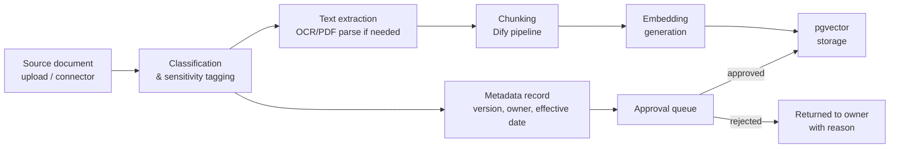
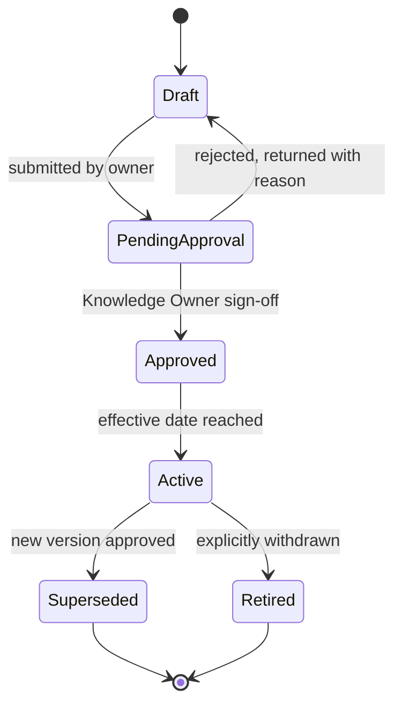

« [Index](00-INDEX.md) | Phase 9 of 16 »

# Phase 9 — Knowledge Architecture

> **v1.0 note:** this phase closes two ACCB items. **Condition C-5**: Dify's operational database is confirmed here (§9.1.1) as a separate instance from the platform's primary Postgres, not an implicit shared one — Review Board Finding C2 ([review/03-data-and-security-review.md](review/03-data-and-security-review.md)). **Mandatory Change 2**: market-data caching (§9.7) is now routed through the same document-lifecycle approval gate as every other Knowledge Memory content type — Review Board Finding C3.

## 9.1 Scope

This is the enterprise RAG system backing Knowledge Memory ([08-memory-architecture.md](08-memory-architecture.md)): MARA policy, SOPs, loan/grant product terms, precedent decisions, and cached market data. It is built as `services/knowledge_service`, an internal API wrapping a self-hosted Dify instance for ingestion/chunking/retrieval ([04-technology-stack.md](04-technology-stack.md)) — agents never talk to Dify directly, they call this service, which is what lets the underlying RAG engine be swapped later without touching agent code.

### 9.1.1 Database boundary (added in v1.0 — closes ACCB Condition C-5)

Dify's own operational database (dataset metadata, ingestion job state, its internal chunking/embedding bookkeeping) runs on a **separate database instance** from the platform's primary Postgres (the one holding Conversation/Task/Shared/Audit Memory and workflow checkpoints — [08-memory-architecture.md](08-memory-architecture.md)). This was previously unstated in the original draft, and the Architecture Review Board flagged the ambiguity as a real risk (Finding C2): running a vendored service you don't intend to schema-migrate in lockstep with your own application against a shared database is the normal way an upgrade of one silently endangers the other. The platform's own pgvector-backed index — used for anything outside Dify's direct management, such as the precedent-decision corpus in §9.7 — is kept distinct from, and clearly labeled as separate from, whichever store is authoritative for Dify's internal state. This decision also directly shapes the DR/backup story in [13-deployment-architecture.md](13-deployment-architecture.md): two databases, two backup schedules, two restore procedures, tracked as such.

## 9.2 Ingestion pipeline

- **Sources**: manual officer upload, and later a connector to MARA's document management system (deferred — see [16-future-expansion.md](16-future-expansion.md)).
- **Classification & sensitivity tagging** happens before anything else, because it determines whether OCR/embedding runs on the self-hosted or cloud-eligible path (Phase 11) — sensitivity is a gate on the pipeline, not a label added after the fact.
- **Chunking**: Dify's configurable chunking strategies (fixed-size with overlap, or structure-aware for policy documents with clear section headers) — policy documents specifically use structure-aware chunking so a retrieved chunk maps to one coherent clause, not an arbitrary character window that could split a clause's condition from its exception.
- **Embedding**: generated via the configured embedding model (provider-abstracted the same way as LLM calls — [04-technology-stack.md](04-technology-stack.md)), stored in pgvector.

## 9.3 Metadata

Every ingested document/chunk carries: source document ID and version, effective date, expiry/superseded date (if applicable), owning department/role, sensitivity classification, and ingestion timestamp. Metadata is what makes retrieval filterable beyond similarity — e.g., the Compliance Agent's RAG query can be scoped to "policy documents, currently effective, compliance-department-owned" rather than relying on similarity search alone to avoid surfacing a superseded policy version that happens to be textually similar.

## 9.4 Version control

Documents are versioned, not overwritten: uploading a revised policy creates a new version record linked to the prior one, with an explicit effective-date transition. Retrieval defaults to the current version, but a workflow that already cited a specific version (e.g., a Loan Assessment that ran its Compliance check against Policy v3) can pin that citation for reproducibility even after Policy v4 is approved — an audit review of a decision made in March must be able to see exactly what policy text existed in March, not what's current today.

## 9.5 Citation and confidence scoring

Every RAG tool response ([06-tool-architecture.md](06-tool-architecture.md)) returns, per retrieved chunk: source document ID, version, page/section reference, and a similarity/relevance score. Agents are required (enforced by output schema, not just prompt instruction) to carry this citation through into any claim that depends on it — this is the mechanical backbone of [05-agent-architecture.md](05-agent-architecture.md)'s provenance-block requirement. A retrieval below a configured relevance threshold is surfaced to the agent as "no confident match," which the agent must then report as such rather than treating a weak match as sufficient support for a claim.

## 9.6 Document lifecycle and approval process

No document reaches the retrievable Active state without an explicit Knowledge Owner approval — this mirrors the Human-in-the-Loop principle from [10-human-in-the-loop.md](10-human-in-the-loop.md) applied to the knowledge base itself: an agent's output is only as trustworthy as the corpus it cites, so the corpus needs the same approval discipline as agent outputs do. Ingestion pipeline failures (extraction errors, chunking failures) block progression to `PendingApproval` rather than allowing a partially-processed document to become approvable.

## 9.7 Knowledge updates and staleness

- **Policy/SOP documents**: updates flow through the lifecycle above; the Compliance Agent's RAG queries always resolve to `Active` versions, and a scheduled job flags workflows currently paused at Approval that cited a document since superseded, so a stale citation doesn't silently ride through a multi-day approval pause.
- **Market data cache** (written by the Market Agent into Knowledge Memory — [05-agent-architecture.md](05-agent-architecture.md) §5.7): **as of v1.0, routed through the same `Draft → PendingApproval → Approved → Active` lifecycle as §9.6**, not exempted from it. This closes an inconsistency the original draft introduced: policy/SOP content required Knowledge Owner sign-off before becoming retrievable, while market data — the one category sourced from the uncontrolled open internet — did not, meaning a single Market Agent run against a low-quality or adversarially-optimized source could become silently-trusted context for every future Risk/Recommendation Agent run in that sector, with no human ever having reviewed it (Review Board Finding C3, [review/03-data-and-security-review.md](review/03-data-and-security-review.md) Red Team #7). Concretely: a cached market finding enters `PendingApproval` automatically on write, and until a Knowledge Owner approves it (or a lightweight, faster-turnaround approval track specific to market data, if the review board's full document-approval SLA proves too slow for search-freshness needs — a call left to Milestone 3 implementation, not pre-decided here), it is retrievable only in an explicitly labeled **low-trust tier** that the Market Agent's own RAG queries may read from provisionally but that Risk/Recommendation Agents must treat as unverified, not as approved knowledge. It also still carries the freshness expiry (default 90 days, configurable per sector) from the original draft, after which it's excluded from retrieval by default and a fresh search is triggered instead of serving stale market context silently.
- **Precedent decisions**: ingested from completed, approved Loan Assessment workflows (with applicant PII redacted per [11-security-architecture.md](11-security-architecture.md)), giving the Risk Agent a growing, versioned precedent corpus without manual curation for every case — but redaction and approval-gating still apply before a precedent record becomes retrievable.

## 9.8 Why Dify and not a bespoke pipeline

Chunking-strategy tuning, embedding-pipeline orchestration, and dataset-admin UI are exactly the "solved problem" category [00-INDEX.md](00-INDEX.md) says not to rebuild — Dify's dataset management is mature, actively maintained, and self-hostable. The isolation boundary (agents call `services/knowledge_service`, never Dify directly, and Dify's own database is a separate instance per §9.1.1) means the actual architectural risk of depending on Dify — being unable to later swap it out, or an internal Dify upgrade endangering platform data — is contained to one service and one database, not spread across every agent's tool integrations or shared with the platform's own transactional data.
