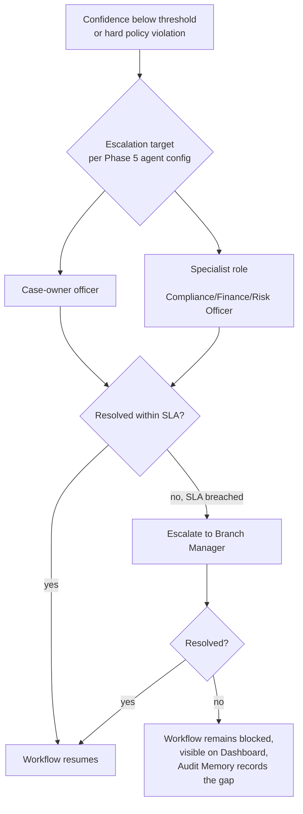

« [Index](00-INDEX.md) | Phase 10 of 16 »

# Phase 10 — Human-in-the-Loop

## 10.1 Principle

Restated from [01-vision.md](01-vision.md) because it governs every design choice in this phase: officers make the final decision. The Approval Service (`services/approval_service`) is the mechanism that makes this true in the running system, not just in a policy document — it is the only path by which a paused LangGraph workflow ([07-workflow-architecture.md](07-workflow-architecture.md)) can be unblocked, and it is invoked the same way regardless of which of the eight workflows reached the gate.

## 10.2 Who approves

| Approval type | Approver role | Workflow stage |
|---|---|---|
| Extraction confirmation (low-confidence fields) | Any assigned Entrepreneurship Officer | Execution → Validation |
| Compliance hard-violation acknowledgment | Compliance Officer | Execution → Validation |
| Financial analysis sign-off | Finance Officer | Validation → Approval |
| Risk rating review | Risk Officer | Validation → Approval |
| Recommendation approval | Entrepreneurship Officer (case owner); escalates to Branch Manager above a configurable exposure threshold | Approval |
| Committee report/deck sign-off | Case owner + Committee Secretary | Completion (pre-distribution) |
| Blocked-workflow manual override | Branch Manager, with documented justification | Any stage, on escalation |
| Audit/PDPA accountability requests | Auditor role (read-only, via Audit Service) | Post-completion, any time |

Approver-role-to-workflow-stage mapping is configuration, not code, held in `configs/*` ([03-repository-structure.md](03-repository-structure.md)) — MARA's actual delegation-of-authority limits (e.g., loan exposure thresholds that require Branch Manager rather than case-owner sign-off) are an operational policy input, not an architectural one, and should be changeable without a deployment.

## 10.3 When approval is required

Two categories, both enforced at the Validation stage ([07-workflow-architecture.md](07-workflow-architecture.md)) so a workflow structurally cannot skip them:

- **Always-required gates**: Recommendation approval and Report/deck sign-off are mandatory on every Loan Assessment instance, full stop — there is no configuration path that removes them, because removing them would violate the non-negotiable principle in [00-INDEX.md](00-INDEX.md).
- **Confidence-triggered gates**: any agent output below its declared confidence threshold ([05-agent-architecture.md](05-agent-architecture.md)) generates an approval request even in workflows/stages that wouldn't otherwise require one — e.g., a Document Agent extraction at 0.6 confidence blocks progression regardless of workflow type.

## 10.4 Approval request contents

Every approval request presented to a human includes: the agent output(s) under review, full provenance/citations, the confidence score and why it triggered (if confidence-triggered), the specific question being asked ("approve this recommendation," "confirm this extracted figure," "acknowledge this compliance exception"), and one-click access to the underlying source document. An approver is never asked to trust a bare assertion — the evidence a human would need to independently verify the claim is presented alongside it, not just linked.

## 10.5 How corrections are handled

An approver has three actions, not two — approve/reject is insufficient because rejection alone discards useful partial work:

- **Approve**: workflow proceeds; the approved output becomes immutable Task Memory (Phase 8) usable by downstream agents/stages.
- **Reject**: workflow returns to Delegation for a targeted re-run of the specific task, with the rejection reason attached as additional context for the re-run (so the agent doesn't repeat the same mistake blind).
- **Correct**: the approver directly edits the output (e.g., fixes a misread figure). The correction is stored as a distinct, attributed record — not merged silently into the agent's original output — so it's always reconstructable which parts of a final artifact were agent-produced versus human-corrected. Corrections also feed Long-term Memory ([08-memory-architecture.md](08-memory-architecture.md)) as calibration signal: an agent whose outputs are frequently corrected on a specific field type is a signal for prompt/tool improvement, surfaced on the Observability dashboard ([12-observability.md](12-observability.md)), not silently absorbed.

## 10.6 Escalation paths

SLA breach thresholds are configurable per approval type (e.g., a compliance hard-violation acknowledgment escalates faster than a low-stakes extraction confirmation). A workflow that exhausts escalation without resolution does not fail silently or time out into an assumed decision — it remains visibly blocked indefinitely, because an unresolved loan application is a record of pending work, not an error to be cleared.

## 10.7 Rollback strategy

Because Task Memory is immutable-once-complete and Shared Memory changes are versioned by producing agent ([08-memory-architecture.md](08-memory-architecture.md)), "rollback" in this system means **reverting to a prior checkpoint and re-running forward with corrected input**, never rewriting history in place:
- A rejected task's re-run creates a new task record; the rejected attempt is retained, not deleted.
- If an approved output is later found to be wrong (e.g., a Compliance Officer discovers a missed exception after sign-off), the correction path is a new, explicitly-flagged **amendment workflow instance** referencing the original — the original approved record stands as the historical decision that was made, and the amendment is its own auditable event. This mirrors how MARA's own paper-based records-correction process would work, and is a deliberate choice: silently mutating an already-approved committee report would itself be an audit-integrity failure.
- Full workflow cancellation (e.g., applicant withdraws) is a distinct terminal state, not a delete — the workflow instance and its Audit Memory remain queryable.

## 10.8 Audit recording

Every approval-service action — request created, approved, rejected, corrected, escalated, SLA breach, override — writes to Audit Memory independently of the workflow's own state transition ([08-memory-architecture.md](08-memory-architecture.md)), with actor, timestamp, and (for corrections/overrides) the recorded justification. This is what makes the Audit Service's reconstruction of "who decided what, and why" complete without needing to infer intent from state diffs.
